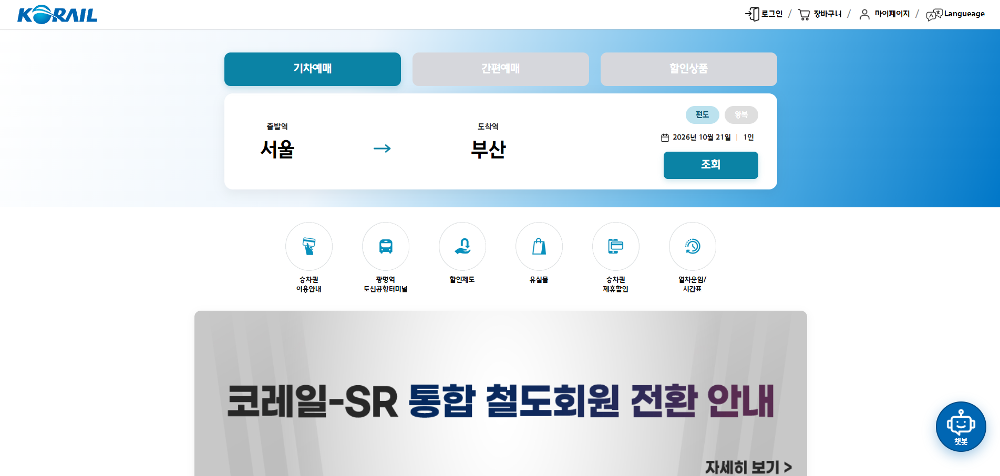
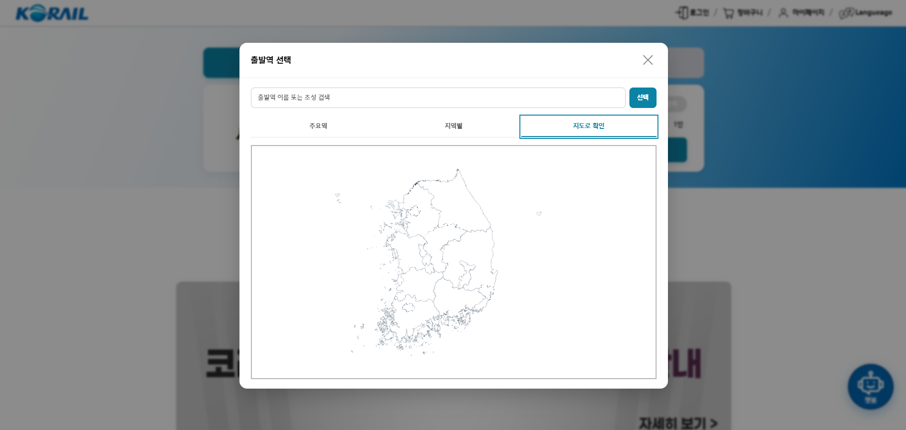
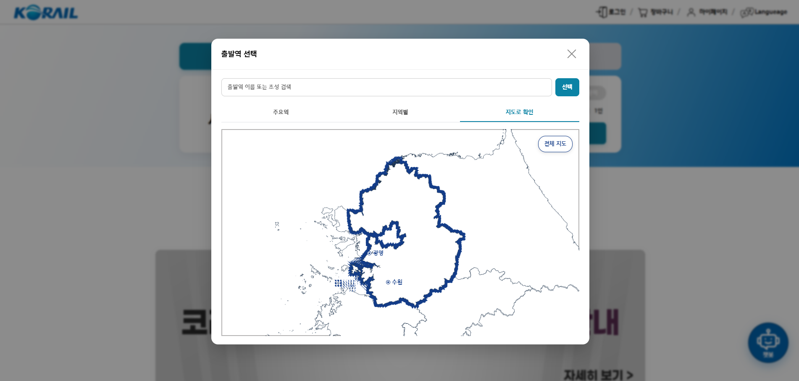
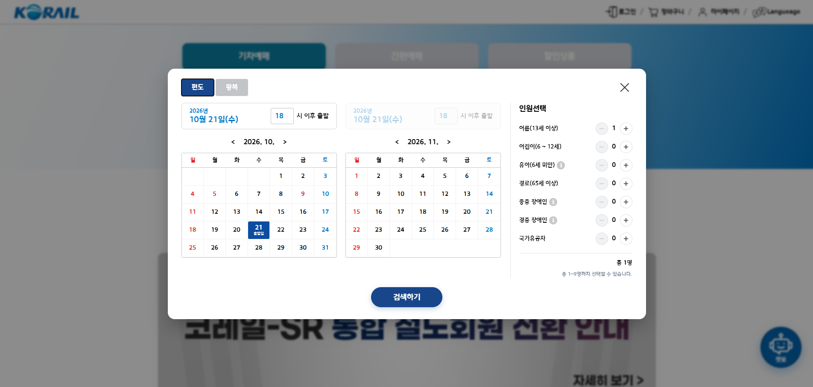
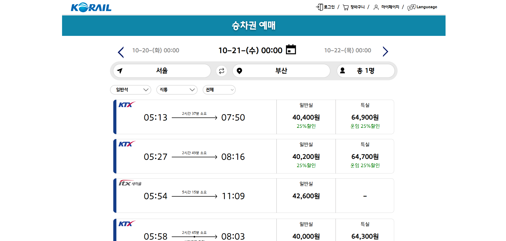
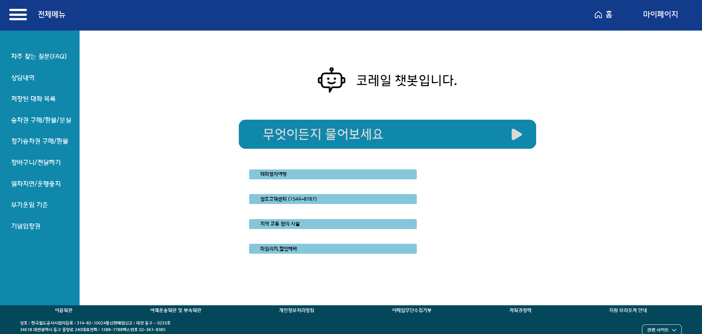
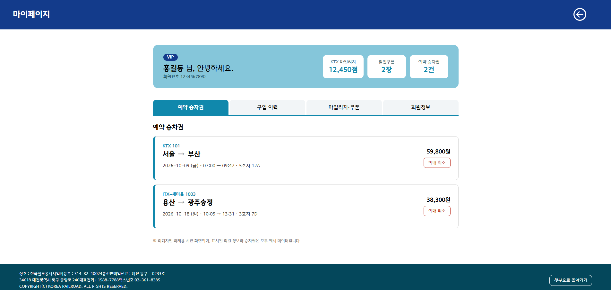

# 프로젝트 소개 - Re:Rail

Re_rail은 코레일 홈페이지의 불편하거나 심미적으로 뒤떨어진 부분을
수정하고 더욱 사용자가 편하게 이용할수 있도록 홈페이지를 리뉴얼하는
리디자인 프로젝트 입니다.

## 배포

https://leesansa.github.io/
위 배포링크 클릭시 Index 페이지로 이동

## 팀원/역할

(팀장) 홍순법 : 팀장 , 챗봇 페이지 제작 

변예담 : figma / 문서 공동담당, 메인페이지 공동 제작, PPT제작 
성시원 : figma / 문서 공동담당, 메인페이지 공동 제작 및 예매 조회 화면 제작 
황건영 : Git 관리담당, 코드 관리 담당, 예약/예매 페이지 제작

메인 페이지

역 선택 페이지 → 지도 파트

예매일시 및 인원 조회 화면

승차권 조회 결과

챗봇 페이지

마이페이지

## 팀원 및 담당 역할

- 홍순법 : 챗봇 페이지 및 마이페이지 담당
- 황건영 : 예매 시간표 및 지도 담당
- 성시원 : 메인사이트 및 예매 조회 화면 담당
- 변예담 : 메인사이트 담당

## 사용 기술

1. HTML
2. CSS
3. JavaScript

## 트러블 슈팅

- 출발일보다 도착일이 빠르게 선택되는 버그 확인.

- 파일을 수정하여 출발일을 선택할 경우 출발일보다 이른 날짜는 선택하지 못하도록 제한.

- 정상 작동 확인.

---

- 예약 페이지에서 팝업 작동시 인원체크 박스 비연동 버그 확인

- 확인을 위해 JS 파일 확인

- 각각의 JS파일이 전부 미연동되었음을 확인함.

- JS 파일을 다시 정리한뒤 연동하는 작업을 실시함

- 정상작동 확인.

### 작업일정 및 파일 공유 방법

Slcak, Notion, 구글 드라이브

### 파일 업로드 가이드

메인 페이지의 경우 index. 폴더에 업로드, 사용한 에셋은 assets 폴더에 따로 정리 해서 올리길 요망
